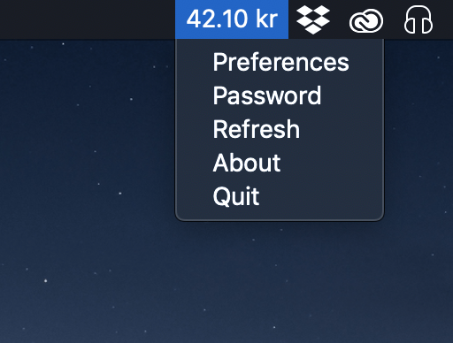
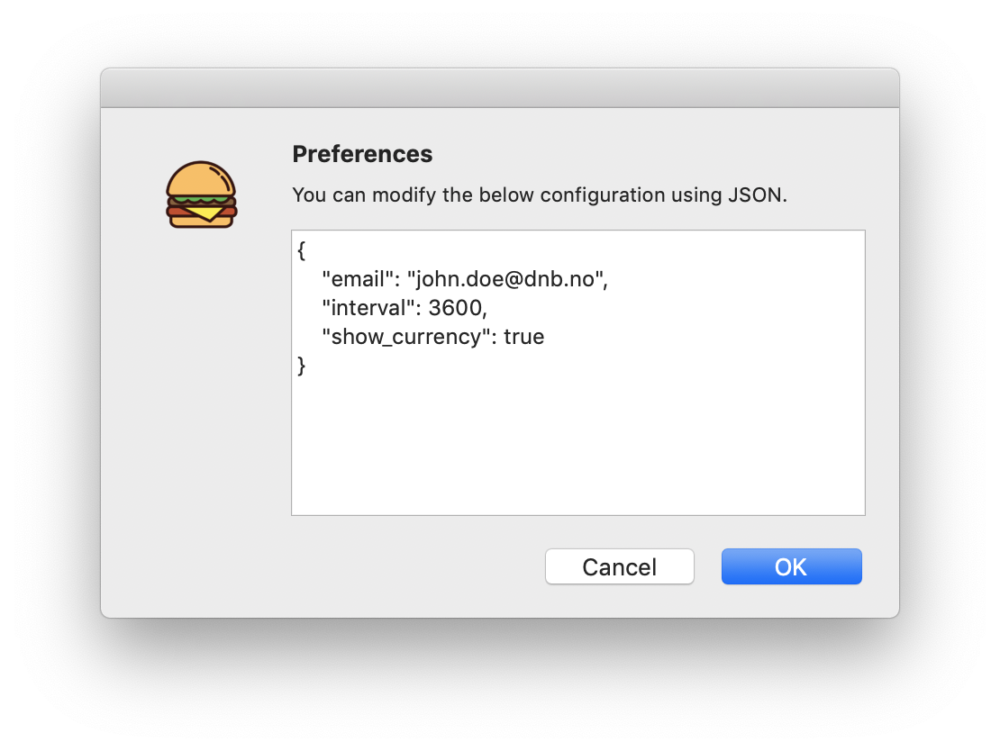
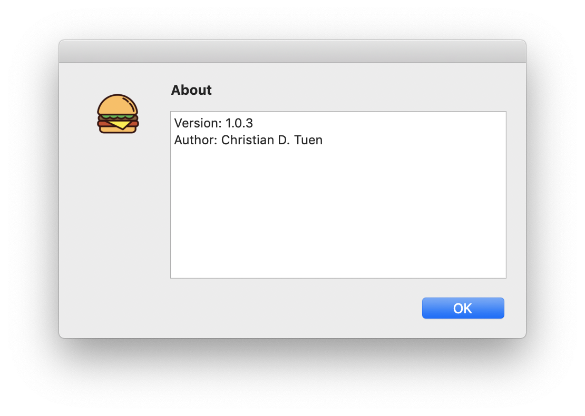
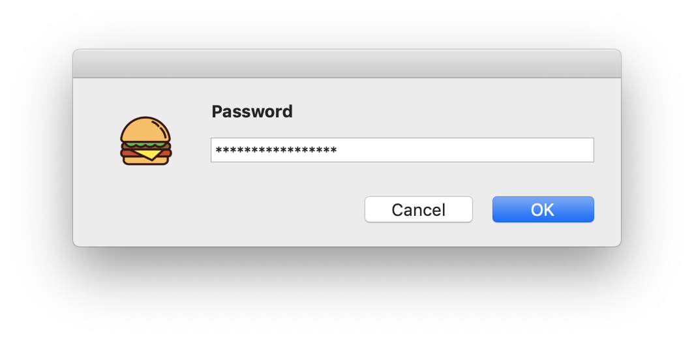

# dnb-lunchbar
Statusbar application for DNB lunch balance

## Install
Download the latest version from [https://github.com/christiandt/dnb-lunchbar/releases](https://github.com/christiandt/dnb-lunchbar/releases). 

Unzip and move `LunchBar.app` to the Applications folder of your computer.

## Gotchas
Please set your password as the first thing you do, so that you don't get failed login attempts against your account (which eventually requires you to go through a recovery process if enough failed attempts have occurred).
The software will read balance from the microsmycentral page, and will only really work as long as DNB never updates that solution. Code is hacked together, expect stuff to break.

## UI Windows

Passwords will be stored in the mac keychain using the default backend.

## Pull Requests and Issues
Please send your PRs, I'll be happy to merge them, as previously noted this is quickly hacked together code, so things will need fixing.
 